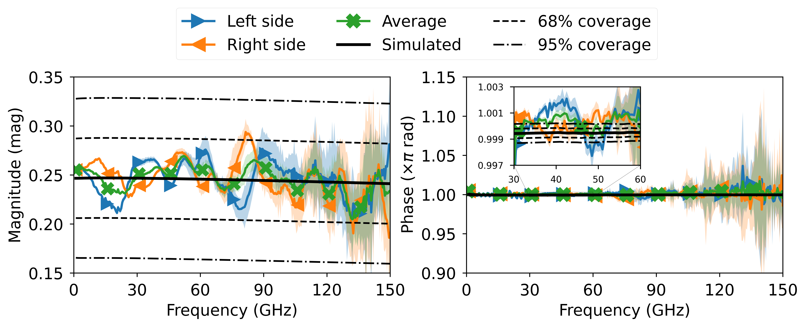
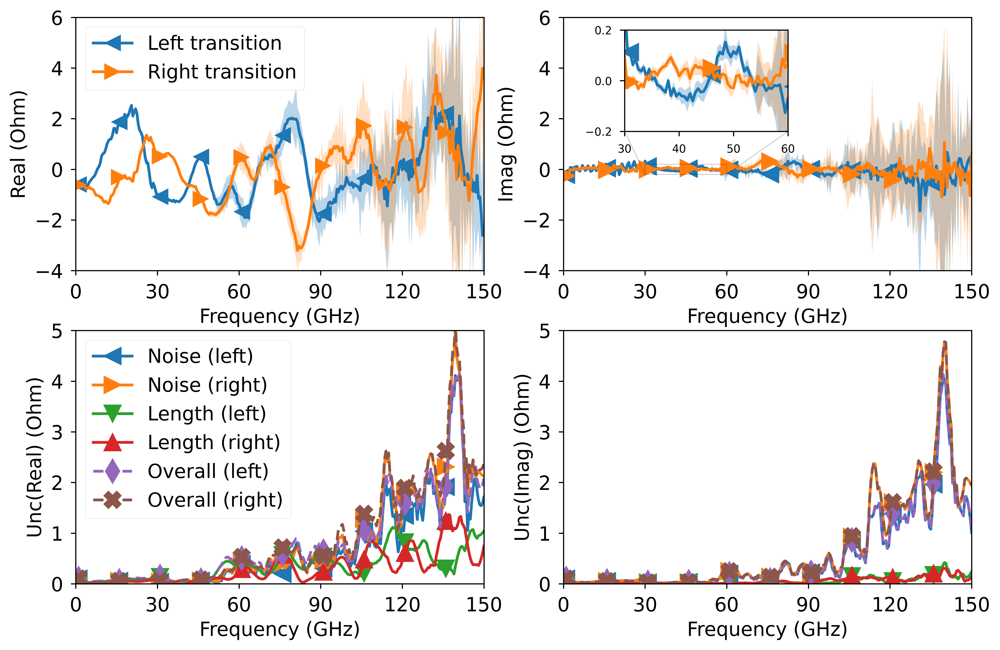

# Verification of Multiline TRL Calibration

A technique for assessing the validity of multiline TRL calibration. The main goal of this method is to identify error in the reference impedance of the calibration. You can find in-depth details about the method in [1]. The mTRL algorithm used is based on [2,3], which you can access here: <https://github.com/ZiadHatab/multiline-trl-calibration>. The uncertainty propagation through the calibration is from here: <https://github.com/ZiadHatab/uncertainty-multiline-trl-calibration>.

## What’s in this repository

The files in this repo includes everything I used to generate the plots in [1]. The measurement are raw wave parameters, which then converted to S-parameters from the VNA. You SCPI code used to collect the data is from here: <https://github.com/ZiadHatab/scpi-anritsu-vectorstar>

*Extracted reflection coefficient of the impedance transformation and validation bounds.*

*Estimated error in the reference impedance of the stepped impedance (30 ohm) and the uncertainty contribution.*

## References

- [1] Z. Hatab, M. E. Gadringer, A. B. Alothman Alterkawi, and W. Bösch, "Validation of the Reference Impedance in Multiline Calibration with Stepped Impedance Standards," e-print: <https://arxiv.org/abs/2209.09163>
- [2] Z. Hatab, M. Gadringer and W. Bösch, "Improving The Reliability of The Multiline TRL Calibration Algorithm," 2022 98th ARFTG Microwave Measurement Conference (ARFTG), 2022, pp. 1-5, doi: [10.1109/ARFTG52954.2022.9844064](https://doi.org/10.1109/ARFTG52954.2022.9844064)
- [3] Z. Hatab, M. Gadringer, and W. Bösch, "Propagation of Linear Uncertainties through Multiline Thru-Reflect-Line Calibration," e-print: <https://arxiv.org/abs/2301.09126>